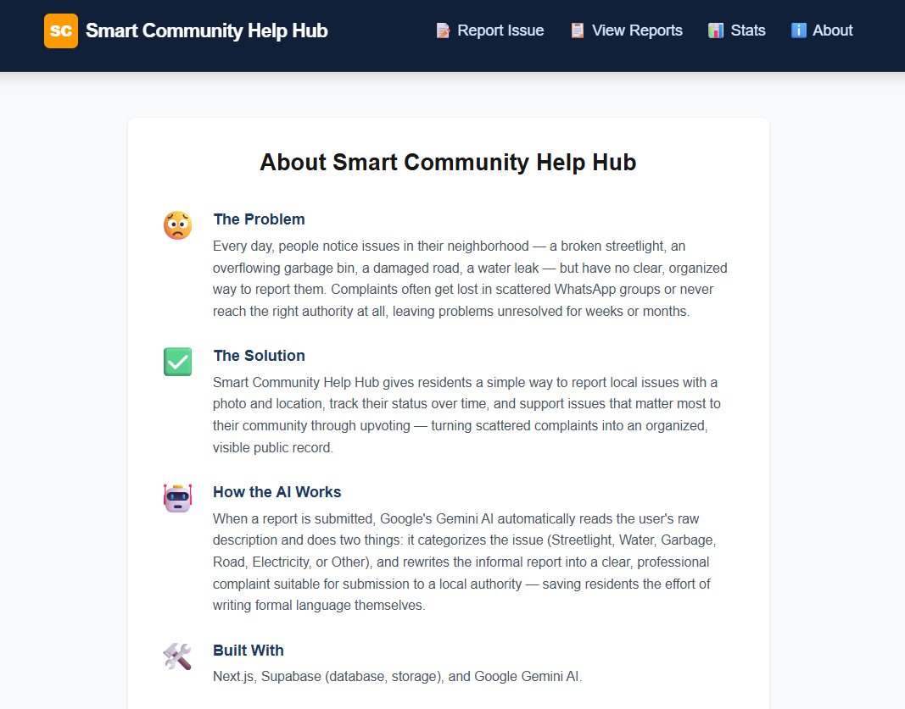
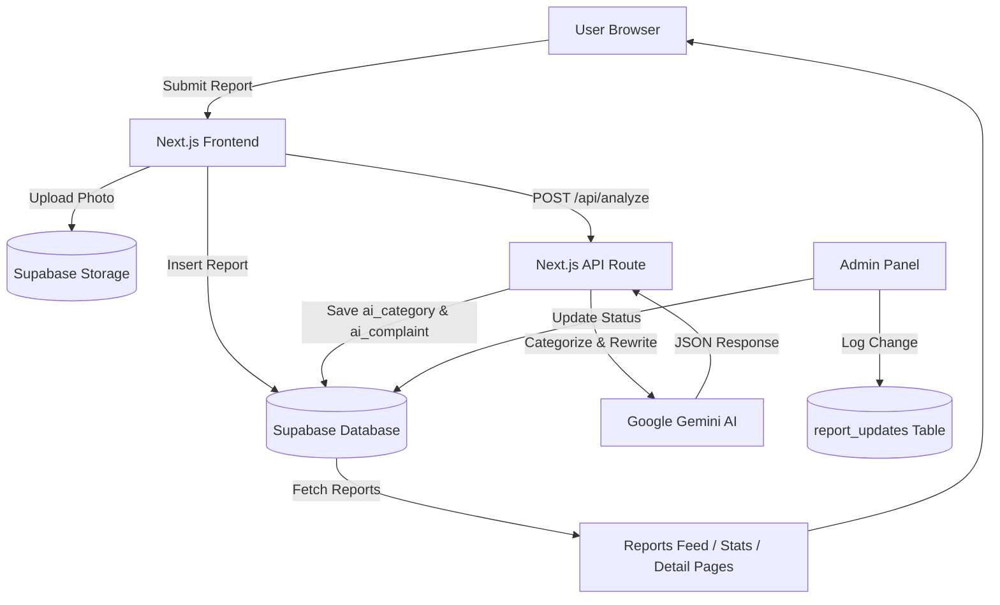

<div align="center">

# 🏙️ Smart Community Help Hub

### AI-Powered Civic Issue Reporting Platform

Report local issues. Get them seen. Get them fixed. An AI-powered platform that turns scattered community complaints into an organized, trackable public record — with automatic categorization, professional complaint rewriting, and full status tracking.

     

🚀 [**Live Demo**](https://smart-community-help-hub.vercel.app/) · 📂 [**GitHub Repository**](https://github.com/Eman-Nisar-Ahmad-dev/smart-community-help-hub) · ℹ️ [**About the Project**](#-overview)

</div>

---


## 📖 Table of Contents
- [Overview](#-overview)
- [The Problem It Solves](#-the-problem-it-solves)
- [Live URL](#-live-url)
- [Features](#-features)
- [Screenshots](#-screenshots)
- [The AI Feature](#-the-ai-feature)
- [Tech Stack](#️-tools-services--models-used)
- [Getting Started (Local Setup)](#-how-to-run-this-project-locally)
- [Admin Access](#-admin-access)
- [Author](#-author)

## 📌 Overview
**Smart Community Help Hub** lets residents report local infrastructure issues — broken streetlights, water leaks, garbage overflow, road damage, and electricity faults — in one organized, public platform. Every report is automatically categorized and rewritten into a professional complaint by AI, then made visible to the community for tracking and upvoting.

## 🎯 The Problem It Solves
People regularly notice problems in their neighborhood but have no clear way to report them. Complaints get lost in scattered WhatsApp groups or never reach the right authority, leaving issues unresolved for weeks. This app gives residents a single, transparent place to report, track, and prioritize community issues.

**Built for**: residents of any neighborhood who want to report local civic issues, and community members who want visibility into what's being reported and resolved nearby.

## 🔗 Live URL

**Production Deployment (Vercel):** [https://smart-community-help-hub.vercel.app](https://smart-community-help-hub.vercel.app)

**GitHub Repository:** [https://github.com/Eman-Nisar-Ahmad-dev/smart-community-help-hub](https://github.com/Eman-Nisar-Ahmad-dev/smart-community-help-hub)

## ✨ Features

| Category | What it does |
|---|---|
| 📝 Report Submission | Title, description, area/location, and photo upload |
| 🤖 AI Categorization | Automatically classifies issues into 6 categories |
| ✍️ AI Complaint Rewriting | Turns informal descriptions into professional complaints |
| 📋 Public Reports Feed | Browse all reports as cards with photo, category, status |
| 🔍 Category Filtering | Filter the feed by issue type |
| ↕️ Sorting | Toggle between Most Recent and Most Upvoted |
| 👍 Community Voting | Upvote issues that matter most |
| 📄 Report Detail Page | Full view with raw + AI-rewritten complaint side by side |
| 🚦 Status Tracking | Pending / In Progress / Resolved badges |
| 🕒 Activity Timeline | Logs status changes with timestamps |
| 🔐 Admin Panel (`/admin`) | Password-protected status management |
| 📊 Insights Dashboard (`/stats`) | Totals, category breakdown chart, status breakdown |
| ℹ️ About Page | Explains the app's purpose and AI feature |
| 🖼️ Image Compression | Client-side compression before upload |
| 🎨 Full Visual Polish | Toasts, skeleton loading, empty states, responsive design |

## 📸 Screenshots

| Home | Reports Feed |
|---|---|
|  |  |

| Report Detail | Stats Dashboard |
|---|---|
|  |  |

| About |
|---|
|  |

## 🤖 The AI Feature

When a user submits a report, their raw title and description are sent to **Google Gemini AI**, which performs two tasks in a single call:
1. **Categorizes** the issue into one of six fixed categories (Streetlight, Water, Garbage, Road, Electricity, Other)
2. **Rewrites** the informal description into a clear, professional, 2–4 sentence complaint suitable for submission to a local authority

**System prompt used:**
This runs server-side via a Next.js API route (`/api/analyze`), keeping the API key secure and never exposed to the browser.

## 🛠️ Tools, Services & Models Used

| Tool | Usage |
|---|---|
| Next.js (App Router, TypeScript) | Core framework |
| Tailwind CSS | Styling |
| Supabase | Postgres database + Storage (photos) |
| Google Gemini (`gemini-3.5-flash-lite`) | AI categorization & complaint rewriting |
| Vercel | Hosting & deployment |
| Git & GitHub | Version control |

## 🏗️ Architecture



**Flow summary:**
1. A user submits a report (title, description, area, photo) through the Next.js frontend.
2. The photo is compressed client-side and uploaded to **Supabase Storage**.
3. The raw text is sent to a secure **Next.js API route** (`/api/analyze`), which calls **Google Gemini AI** to categorize the issue and rewrite it professionally.
4. Both the original data and the AI-generated fields are saved to the **Supabase Database**.
5. The **Reports Feed**, **Report Detail**, and **Stats Dashboard** pages all read live data directly from Supabase.
6. The **Admin Panel** allows status updates, which are simultaneously logged to a separate `report_updates` table, powering each report's Activity Timeline.

## 🚀 How to Run This Project Locally

### Prerequisites
- Node.js installed
- A Supabase account and project
- A Google Gemini API key

### Setup
```bash
git clone https://github.com/Eman-Nisar-Ahmad-dev/smart-community-help-hub.git
cd smart-community-help-hub
npm install
```

Create a `.env.local` file in the root directory:

NEXT_PUBLIC_SUPABASE_URL=your_supabase_project_url
NEXT_PUBLIC_SUPABASE_ANON_KEY=your_supabase_anon_key
GEMINI_API_KEY=your_gemini_api_key
NEXT_PUBLIC_ADMIN_PASSWORD=your_chosen_admin_password

Set up the database — run this SQL in the Supabase SQL Editor:
```sql
create table reports (
  id uuid default gen_random_uuid() primary key,
  title text not null,
  raw_description text not null,
  ai_category text,
  ai_complaint text,
  photo_url text,
  area text,
  status text default 'Pending',
  votes int default 0,
  created_at timestamp default now()
);

create table report_updates (
  id uuid default gen_random_uuid() primary key,
  report_id uuid references reports(id) on delete cascade,
  message text not null,
  created_at timestamp default now()
);
```

Create a public Storage bucket named `report-photos` in Supabase, then run:
```bash
npm run dev
```
Open [http://localhost:3000](http://localhost:3000).

## 🔐 Admin Access
The admin panel is available at `/admin`, protected by the password set in `NEXT_PUBLIC_ADMIN_PASSWORD`. It allows updating any report's status (Pending / In Progress / Resolved), which is automatically logged to that report's Activity Timeline.

## 🗺️ Upcoming Work

- [ ] **User Authentication** — allow residents to create accounts, track their own submitted reports, and receive notifications when status changes
- [ ] **Map View** — plot all reports on an interactive map using real GPS coordinates instead of manually typed area names
- [ ] **Push/Email Notifications** — notify the original reporter automatically when an admin updates their report's status
- [ ] **Multi-Admin Roles** — replace the single shared admin password with per-department accounts (e.g., a Water Department admin only sees Water reports)
- [ ] **Public API** — expose a read-only API so local government systems could integrate directly with report data
- [ ] **Duplicate Report Detection** — use AI to flag when a new report likely describes the same issue as an existing one, and merge upvotes automatically
- [ ] **Multi-language Support** — allow reports and the AI rewrite to be submitted/generated in Urdu as well as English

## 👤 Author
**Eman Nisar Ahmad**
BS Information Technology Student
GitHub: [@Eman-Nisar-Ahmad-dev](https://github.com/Eman-Nisar-Ahmad-dev)

---

*Built as part of a final project — end-to-end designed, built, and deployed independently.*