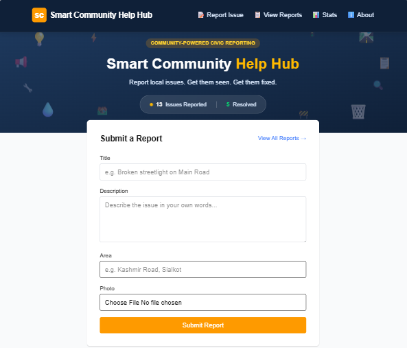
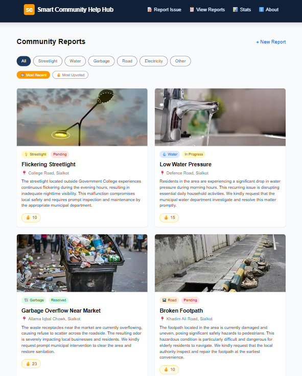
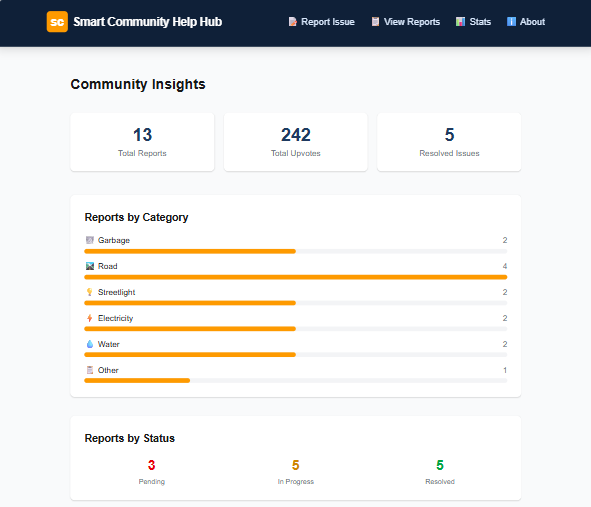

# 🏙️ Smart Community Help Hub

## App Name & Overview
**Smart Community Help Hub** is a civic-tech web app that lets residents report local infrastructure issues — broken streetlights, water leaks, garbage overflow, road damage, and electricity faults — in one organized, public platform.

### The Problem It Solves
People regularly notice problems in their neighborhood but have no clear, structured way to report them. Complaints get lost in scattered WhatsApp groups or never reach the right authority, leaving issues unresolved for weeks. This app gives residents (and, indirectly, local authorities) a single, transparent place to report, track, and prioritize community issues — turning informal complaints into an organized public record.

**Built for**: residents of any neighborhood or city who want to report local civic issues, and community members who want visibility into what's being reported and resolved nearby.

## 🔗 Live URL
**[https://vercel.com/eman-nisar-ahmad-devs-projects/smart-community-help-hub](https://vercel.com/eman-nisar-ahmad-devs-projects/smart-community-help-hub)**

## ✨ Features
- **Report submission** — title, description, area/location, and photo upload
- **AI-powered categorization** — automatically classifies each report (Streetlight, Water, Garbage, Road, Electricity, Other)
- **AI-powered complaint rewriting** — converts informal user descriptions into professional, formal complaints suitable for submission to local authorities
- **Public reports feed** — browse all submitted reports as cards with photos, categories, and status
- **Category filtering** — filter reports by issue type
- **Sorting** — toggle between Most Recent and Most Upvoted
- **Community voting** — upvote issues that matter most to you
- **Report detail page** — full view of each report, including both the raw and AI-rewritten complaint side by side
- **Status tracking** — Pending / In Progress / Resolved, visible as color-coded badges
- **Activity timeline** — logs status changes per report with timestamps
- **Admin panel** (`/admin`) — password-protected page to update any report's status
- **Community Insights dashboard** (`/stats`) — total reports, total upvotes, category breakdown chart, status breakdown
- **About page** — explains the app's purpose and how the AI works
- **Image compression** — photos are compressed client-side before upload for faster load times
- **Fully responsive design** with a custom civic-themed visual identity (deep blue + amber), toast notifications, skeleton loading states, and empty states

## 🤖 The AI Feature
When a user submits a report, their raw title and description are sent to **Google Gemini AI**, which performs two tasks in a single call:
1. **Categorizes** the issue into one of six fixed categories (Streetlight, Water, Garbage, Road, Electricity, Other)
2. **Rewrites** the informal description into a clear, professional, 2–4 sentence complaint suitable for submission to a local authority

**System prompt used:**

This runs server-side via a Next.js API route (`/api/analyze`), keeping the API key secure and never exposing it to the browser.

## 🛠️ Tools, Services & Models Used
- **Framework**: Next.js (App Router, TypeScript)
- **Styling**: Tailwind CSS
- **Database & Storage**: Supabase (Postgres database + Storage buckets for photos)
- **AI Model**: Google Gemini (`gemini-3.5-flash-lite`) via `@google/generative-ai`
- **Hosting/Deployment**: Vercel
- **Version Control**: Git & GitHub

## 📸 Screenshots
*(Insert 3+ screenshots here — see instructions below)*






## 🚀 How to Run This Project Locally

### Prerequisites
- Node.js installed
- A Supabase account and project
- A Google Gemini API key

### Setup
1. Clone the repository:
```bash
   git clone https://github.com/YOUR_USERNAME/smart-community-help-hub.git
   cd smart-community-help-hub
```
2. Install dependencies:
```bash
   npm install
```
3. Create a `.env.local` file in the root directory with:

NEXT_PUBLIC_SUPABASE_URL=your_supabase_project_url
NEXT_PUBLIC_SUPABASE_ANON_KEY=your_supabase_anon_key
GEMINI_API_KEY=your_gemini_api_key
NEXT_PUBLIC_ADMIN_PASSWORD=your_chosen_admin_password

4. Set up the Supabase database — run this SQL in the Supabase SQL Editor:
```sql
   create table reports (
     id uuid default gen_random_uuid() primary key,
     title text not null,
     raw_description text not null,
     ai_category text,
     ai_complaint text,
     photo_url text,
     area text,
     status text default 'Pending',
     votes int default 0,
     created_at timestamp default now()
   );

   create table report_updates (
     id uuid default gen_random_uuid() primary key,
     report_id uuid references reports(id) on delete cascade,
     message text not null,
     created_at timestamp default now()
   );
```
5. Create a public Storage bucket named `report-photos` in Supabase.
6. Run the development server:
```bash
   npm run dev
```
7. Open [http://localhost:3000](http://localhost:3000).

The admin panel is accessible at `/admin` using the password set in `NEXT_PUBLIC_ADMIN_PASSWORD`.